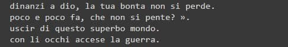

# neuraltextgen

Implementation of a text-generation method using BERT, starting from the methodology proposed in the paper "BERT has a Mouth, and It Must Speak: BERT as a Markov Random Field Language Model" - Alex Wang, Kyunghyun Cho (https://arxiv.org/pdf/1902.04094.pdf). The method is based on an iterative procedure based on three main steps:

 1. initialization: of the batch of sentences. Each sentence is composed by a list of tokens initialized as 
    '[MASK]'
 2. sampling: at each iteration one token for each sentence is selected randomly
 3. replacement: at each iteration the tokens selected are replaced randomly based on the logits outputted by
     BERT

Extensions:

 - implementation of new initialization method that give the possibility to choose between all "[MASK]" tokens, all random tokens or a mix of the two, based on a single parameter for the mask-token probability
 - implementation of new sampling method based on the attention of the token chosen on the previous 
    iteration
 - implementation of a unique framework able to deal with different languages
 - currently implementing fine-tuning on specific tasks for an italian model

 
